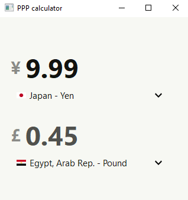

# Currency Converter (countries)

Currently converts one currency to another based on their Purchaseing Power Parities (PPP). 🏗 Exchange rate conversion coming soon.

## Dev

1. Clone repo
2. Install packages (root directory)

```sh
pipenv install
```

3. Start App

```sh
pipenv run dev
```

### Other Commands

- After adding image/icon path to icons.qrc file, run following command before use:

```sh
pipenv run qrc
```

This will regenerate the rc_icons.py file which is import in app.py file.

## Showcase

